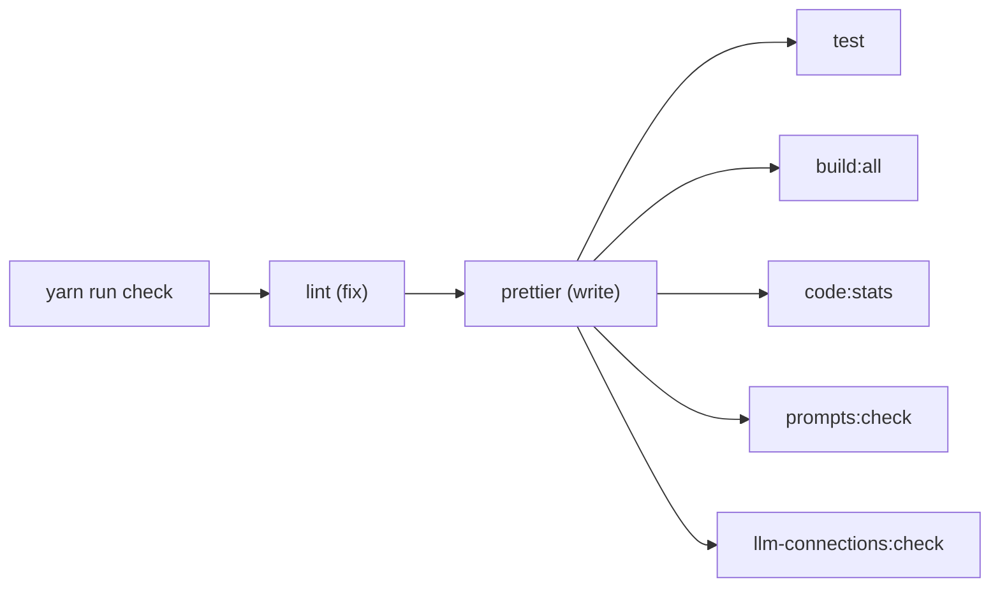
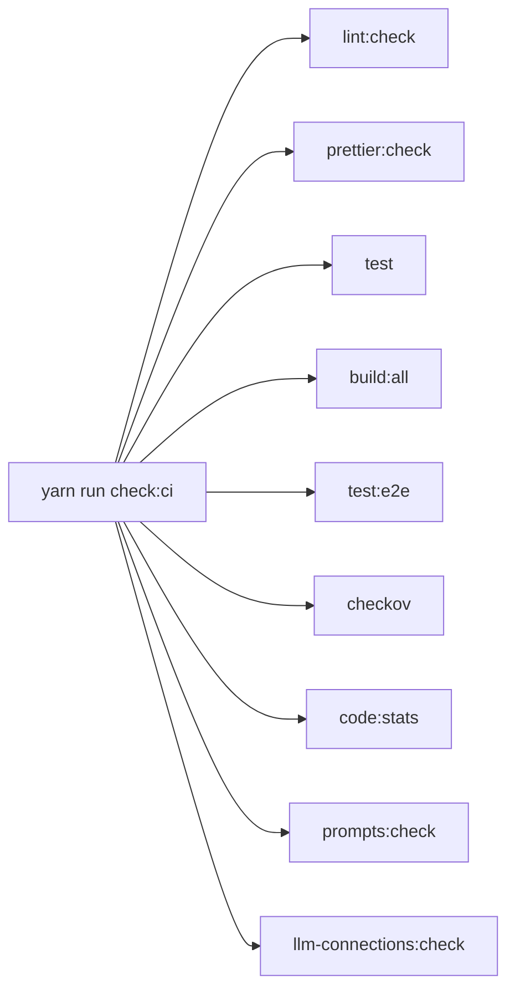
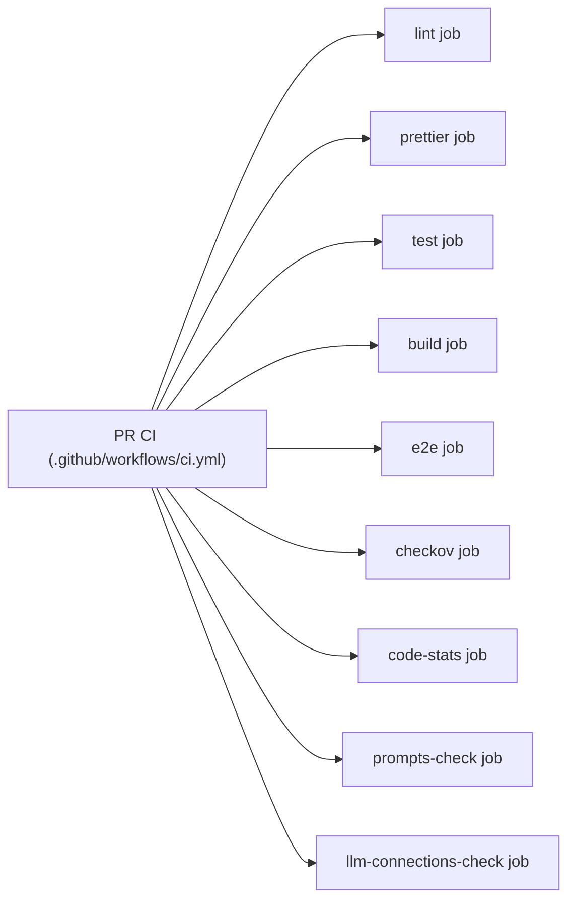
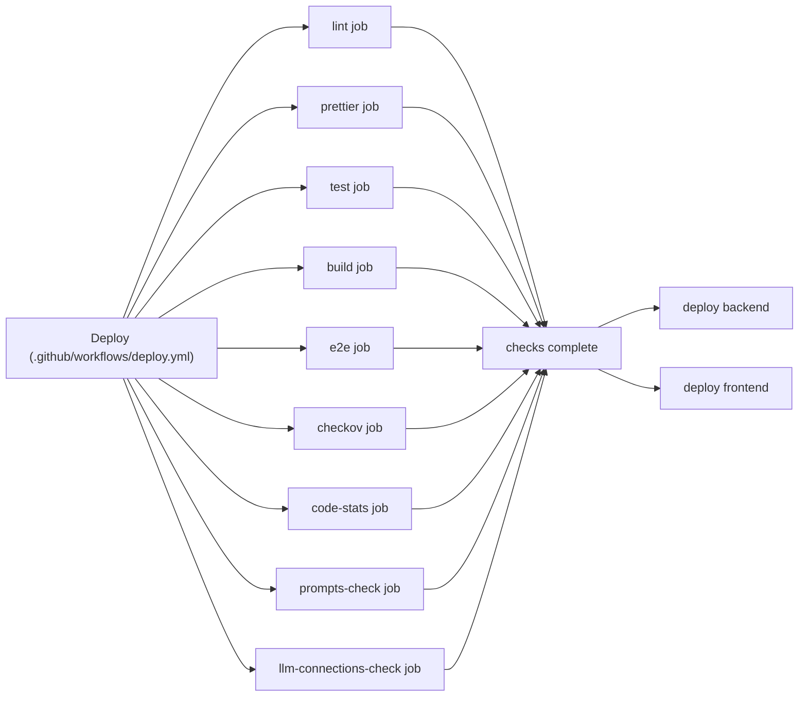

# Chronote

A Discord bot that records voice meetings, transcribes them with OpenAI, generates notes, and posts results back to Discord. It also supports billing, tagging, dictionary terms for domain jargon, and a static frontend.

[Add the bot to your server](https://discord.com/oauth2/authorize?client_id=1278729036528619633)

## Commands

- `/startmeeting`: Begin recording the meeting (audio + chat logs).
- `/autorecord`: Configure auto-recording for a server/channel.
- `/context`: Manage prompt context.
- `/dictionary`: Manage dictionary terms used in prompts.
- `/ask`: Ask questions over recent meeting history (guild scope by default).
- `/onboard`: Guided setup (context, auto-record, feature tour, upgrade CTA).

## Run locally

1. `yarn install`
2. Install FFMPEG (e.g., `choco install ffmpeg` on Windows).
3. Copy `.env.example` to `.env`; set required keys: `DISCORD_BOT_TOKEN`, `DISCORD_CLIENT_ID`, `OPENAI_API_KEY`. Optional: Stripe keys to enable checkout/portal endpoints; `USE_LOCAL_DYNAMODB=true` for local tables. For Langfuse prompt sync or tracing, set `LANGFUSE_PUBLIC_KEY` and `LANGFUSE_SECRET_KEY`. Optional: `LANGFUSE_BASE_URL`, `LANGFUSE_PROMPT_LABEL`.
   - For mock portal data + OAuth bypass, set `MOCK_MODE=true` (no Discord/Dynamo required), or run `yarn start:mock` / `yarn dev:mock` to toggle mock mode without editing `.env`.
   - Deployed ECS uses **AWS Secrets Manager** for secrets (see `_infra/README.md`).
4. Start everything (local Dynamo + table init + bot): `yarn dev`
5. Frontend (Vite + Mantine) hot reload: `yarn frontend:dev`
6. Cloud workspace prep and mock-friendly env snippets: see `AGENTS.md` and `scripts/mock.env.example`

### DynamoDB local helpers

- `yarn docker:up` / `yarn docker:down` – start/stop local Dynamo + admin UI
- `yarn db:init` – create tables locally
- `yarn dev:clean` – wipe local Dynamo data and restart

### Langfuse prompt sync

- Prompts live in `prompts/` as Markdown with YAML front matter.
- Shared prompt blocks live in `prompts/_fragments/` and can be composed via `extends` in front matter.
- `yarn prompts:push` syncs local prompts to Langfuse and skips unchanged prompts by default. Use `--dry-run` or `--debug-diff` when needed.
- `yarn prompts:pull` pulls prompts from Langfuse into `prompts/`. It skips prompts that use `extends` unless `--force` is passed.
- `yarn prompts:check` compares local prompts to Langfuse. It runs inside `yarn run check` and CI.
- Prompt sync scripts use the Langfuse JS SDK and read the same `LANGFUSE_*` env vars as runtime.

### Langfuse LLM connection sync

- LLM connections live in `langfuse/llm-connections/*.yml`.
- `yarn llm-connections:push` upserts local connections to Langfuse.
- `yarn llm-connections:pull` pulls connections from Langfuse into YAML files.
- `yarn llm-connections:check` compares local YAML with Langfuse (keys only, no secrets). It runs inside `yarn run check` and CI.
- Details and schema: `docs/langfuse-llm-connections.md`.

## Checks

These checks run before PR merge and deployment. Use `yarn run check` for the full local gate with auto-fix. Use `yarn run check:ci` to mirror CI, including prompt sync, e2e, and IaC scans.

- Lint (ESLint) keeps code quality and catches common bugs. Commands: `yarn lint` (auto-fix) or `yarn lint:check` (CI). Docs: https://eslint.org/docs/latest/use/command-line-interface
- Format (Prettier) enforces consistent formatting. Commands: `yarn prettier` (write) or `yarn prettier:check` (CI). Docs: https://prettier.io/docs/cli
- Unit and integration tests (Jest) protect behavior and enforce coverage thresholds in `jest.config.ts`. Command: `yarn test`. Coverage requirements (global): statements 30%, branches 60%, functions 40%, lines 30%. Docs: https://jestjs.io/docs/29.7/configuration
- Build (TypeScript + Vite) validates type safety and production bundles. Commands: `yarn build` (tsc), `yarn build:web` (vite build), and `yarn build:all` (both). Docs: https://www.typescriptlang.org/docs/handbook/compiler-options.html and https://vite.dev/guide/
- E2E tests (Playwright) validate critical user flows. Command: `yarn test:e2e`. Docs: https://playwright.dev/docs/running-tests
- Visual regression (Playwright screenshots) flags UI changes. Commands: `yarn test:visual` and `yarn test:visual:update`. Details: `docs/visual-regression.md`.
- Code stats and complexity (scc + lizard) keep size and complexity visible. Command: `yarn code:stats`. Use `.sccignore` to exclude paths from scc output. `whitelizard.txt` can suppress known complexity offenders. Docs: https://github.com/boyter/scc and https://github.com/terryyin/lizard
- Prompt sync (Langfuse) keeps repo prompt files aligned with Langfuse. Command: `yarn prompts:check`.
- LLM connection sync (Langfuse) keeps LLM connection YAML aligned with Langfuse. Command: `yarn llm-connections:check`.
- IaC scan (Checkov via uvx) catches Terraform misconfigurations. Command: `yarn checkov`. Docs: https://www.checkov.io/2.Basics/CLI%20Command%20Reference.html and https://docs.astral.sh/uv/concepts/tools/

CI runs the same set as `yarn run check:ci` (see `.github/workflows/ci.yml`).

### Check dependencies (Mermaid)

`yarn run check`



`yarn run check:ci`



PR CI workflow



Deploy workflow (prod)



Staging deploy is similar but skips Checkov and allows unit test failures to continue. Prompt and LLM connection checks still run.

Coverage update rule:

- After coverage improvements or coverage scope changes, round each threshold down to the nearest 10 and keep it in sync with `jest.config.ts`. Do not lower a threshold below its pre-PR value unless the coverage scope meaningfully expands, in which case reset to the new rounded baseline and call it out in the PR.

## Frontend

- Vite + React 19 + Mantine 8 UI under `src/frontend/`, builds to `build/frontend/`.
- Routing/data/state: TanStack Router + TanStack Query + tRPC + Zustand.
- Marketing site is public at `/`; the authenticated portal lives under `/portal/*`:
  - `/portal/select-server`
  - `/portal/server/:serverId/{library|ask|billing|settings}`
- Deployed via GitHub Actions to S3 + CloudFront (see `_infra/` and `.github/workflows/deploy.yml`).
- Static hosting variables: `FRONTEND_BUCKET`, `FRONTEND_DOMAIN` (optional), `FRONTEND_CERT_ARN` (when custom domain is set). Allow the SPA to call the API by setting `FRONTEND_ALLOWED_ORIGINS` (comma-separated, e.g., CloudFront domain). CloudFront distribution outputs are emitted by Terraform.
- API hosting: backend runs behind an ALB when `API_DOMAIN` is set (e.g., `api.chronote.gg`). Terraform sets a GitHub Actions env var `VITE_API_BASE_URL` so the frontend uses the API domain at build time. OAuth callback should be `https://api.<domain>/auth/discord/callback`.
- Local dev uses Vite proxying for `/auth`, `/user`, `/api`, and `/trpc` (tRPC).

## Backend / services

- Bot + API: Node 22, Express 5. API routes are modularized under `src/api/` (billing, guilds). New typed API surface is tRPC at `/trpc` (routers in `src/trpc/`).
- Voice capture: discord.js v14, @discordjs/voice/opus, prism-media.
- Transcription flow and tuning: `docs/audio-transcription.md`.
- Feature toggle evaluation checklist: `docs/feature-toggles.md`.
- OpenAI: gpt-4o-transcribe for ASR, gpt-5.1 for notes/corrections, gpt-5-mini for live gate, DALL-E 3 for images.
- Prompt management and tracing: Langfuse for prompt versioning, tracing, and prompt sync scripts.
- Billing: Stripe Checkout + Billing Portal; webhook handler persists GuildSubscription and PaymentTransaction in DynamoDB and handles payment_failed / subscription_deleted to downgrade appropriately (guild-scoped billing only).
- Sessions: Express sessions stored in DynamoDB `SessionTable` (TTL on `expiresAt`).
- Storage: DynamoDB tables include GuildSubscription, PaymentTransaction, StripeWebhookEventTable (idempotency with TTL), AccessLogs, RecordingTranscript, AutoRecordSettings, ServerContext, ChannelContext, DictionaryTable, MeetingHistory, AskConversationTable, SessionTable, InstallerTable, OnboardingStateTable. Transcripts and audio artifacts go to S3 (`TRANSCRIPTS_BUCKET`).

### Stripe webhook testing (local)

1. Install the Stripe CLI and authenticate: `stripe login`.
2. In one terminal, start the webhook forwarder and copy the webhook signing secret it prints:
   - `yarn stripe:listen`
   - Set `STRIPE_WEBHOOK_SECRET` to the secret value for local testing.
3. In another terminal, send fixture events:
   - `yarn stripe:trigger:checkout`
   - `yarn stripe:trigger:invoice-paid`
   - `yarn stripe:trigger:invoice-failed`
   - `yarn stripe:trigger:subscription-updated`
   - `yarn stripe:trigger:subscription-deleted`

Notes:

- CLI triggers emit fixture events. For end-to-end metadata (guild_id, discord_id), run a real checkout from the UI and complete the Stripe test flow.
- The webhook route expects a raw request body (`express.raw`) for signature verification, so it must be mounted before `express.json()` (already wired in `src/webserver.ts`).

## Infrastructure

- Terraform in `_infra/` provisions ECS/Fargate bot, Dynamo tables, transcripts bucket, SessionTable, and the static frontend (S3 + CloudFront with OAC, SPA fallback).
- When `API_DOMAIN` is set, Terraform also provisions an internet-facing ALB for the API (listener on 80/443) plus Route53 alias + ACM cert.
- Runtime secrets for ECS are stored in **AWS Secrets Manager** and referenced by the task definition (see `_infra/README.md`).
- Helpers: `yarn terraform:init | plan | apply`.
- IaC scanning: `yarn checkov` (Checkov) locally; also runs in CI.

### GitHub personal access token rotation

Terraform uses a GitHub provider to manage the Actions environment and variables for this repo. Rotate the PAT when it expires or after moving the repo to a new org.

1. Generate a fine-grained token using the GitHub URL template (pre-fills the form):
   ```
   https://github.com/settings/personal-access-tokens/new?name=Chronote+Terraform&description=Terraform+GitHub+provider&target_name=BASIC-BIT&expires_in=90
   ```
2. In the token UI, set **Repository access** to **Only select repositories** and choose `meeting-notes-discord-bot` (manual step), then grant these **Repository permissions**:
   - **Actions**: Read (Terraform reads environments).
   - **Administration**: Read and write (Terraform creates/updates environments).
   - **Environments**: Read and write (Terraform manages environment variables).
   - **Metadata**: Read (Terraform reads repo metadata).
3. Set the new token in the active Terraform vars file:
   - `_infra/terraform.tfvars` for prod.
   - `_infra/terraform.staging.tfvars` if you use a separate staging var file.
4. Re-run `yarn terraform:plan` and `yarn terraform:apply` (or `terraform -chdir=_infra plan` and `terraform -chdir=_infra apply`) to confirm the GitHub provider can read the repo and update Actions env variables.

### Observability (hosted)

- AMP (Amazon Managed Prometheus) and AMG (Amazon Managed Grafana) are provisioned by Terraform. AMG requires IAM Identity Center (AWS SSO) to be enabled in the account.
- **Manual Grafana service account token (one-time):**
  1. In the AWS console: Amazon Managed Grafana → open your workspace.
  2. In Grafana: _Administration → Service accounts_ → **New service account** (role: Admin) and create a token.
  3. Export `GRAFANA_API_KEY=<service account token>` (or set `TF_VAR_grafana_api_key`) before running `terraform apply`.
  4. Set `GRAFANA_URL` (or `TF_VAR_grafana_url`) to the AMG endpoint shown in the console (e.g., `https://g-xxxx.grafana-workspace.us-east-1.amazonaws.com/`).
  5. The Grafana provider uses that URL + token to create the Prometheus data source pointing at AMP and a starter dashboard.

### Observability (local)

- `yarn observability:up` → starts local Prometheus (scrapes `host.docker.internal:3001/metrics`) and Grafana on :3000 with a pre-provisioned Prom datasource.
- `yarn observability:down` to stop.

## Code complexity with scc and lizard

Setup:

- Install scc (Windows): `choco install scc` (run in an elevated shell).
- Install lizard: `python -m pip install lizard`
- Run: `yarn code:stats`

## Contribution

Contributions are welcome! Open an issue or PR with ideas or improvements.

## License

AGPL-3.0-or-later.
